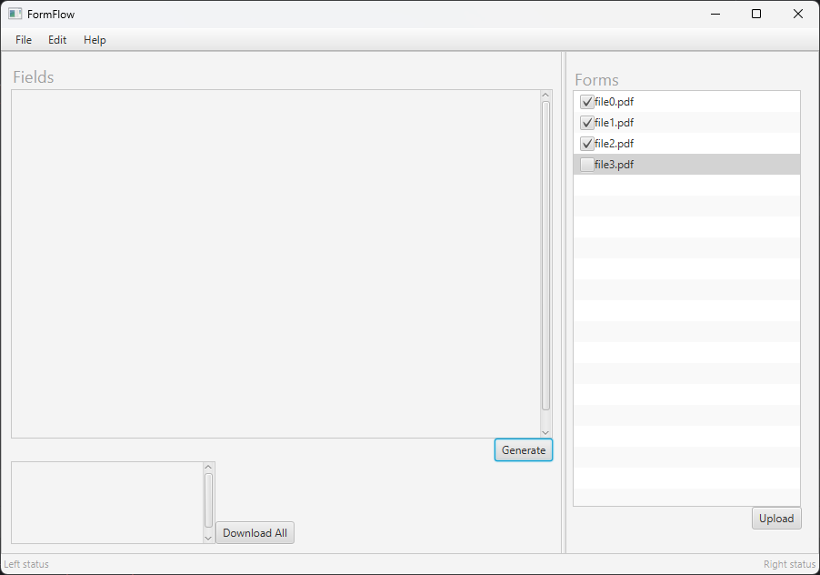

# FormFlow
The product that we are developing is a Java application that assists users in filling out application forms. The target customers for this application are tech-savvy professionals who need to save time when filling out forms. The objective of developing this product is to reduce redundancies wherever possible when filling out forms. This can be especially useful in a series of forms that ask for the same information. In broad strokes, the way the application itself will work is first the user uploads the forms they need to fill out. Then FormFlow scans the PDF and presents the user with all the relevant fields that need to be answered by the forms. The user will fill them out in one place on FormFlow and the application will fill out the documents. 

The baseline goal is scanning documents, and presenting their fields, repeated or otherwise to the user to fill out. This way the user fills out their information once to complete a series of forms that ask for the same thing. This will only be a successful project if our product design itself is good. Once we have the mechanics of the application our goal is to make it easy to use. The market is tech-savvy professionals, but it should be useable and understandable for anyone with basic computer knowledge to consider it a success. There are also features we may be able to implement to supplement the application like pre-logged user information, but for the scope of this project that may present security issues we are not equipped to deal with yet. It is something to consider if we have time at the end of the semester, which is unlikely. 

# How to run
- Download the executable and run the app
- You will see the FormFlow UI!

# How to contribute
Follow this project board to know the latest status of the project: [http://...]([http://...])  

### How to build
- Use this github repository: ... 
- Specify what branch to use for a more stable release or for cutting edge development.  
- Use InteliJ 11
- Specify additional library to download if needed 
- What file and target to compile and run. 
- What is expected to happen when the app start. 
