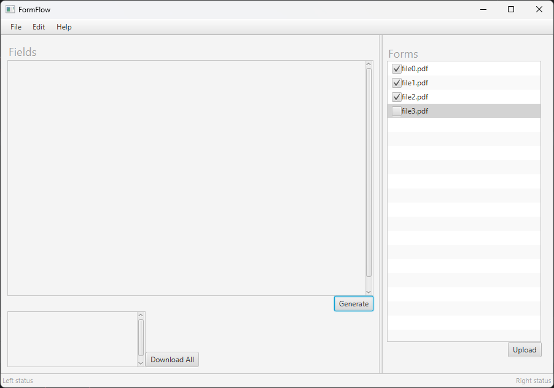

# FormFlow
This product  is a Java application designed to facilitate the completion of application forms. 
The target audience for this application comprises technologically proficient professionals seeking 
to optimize their time during the form-filling process. This product significantly expedites form completion, 
with the overarching objective of minimizing redundancies in the form-filling experience, particularly in 
scenarios involving multiple forms requesting identical information.

At a high level, the operational workflow of the application involves the user uploading the forms requiring 
completion. Subsequently, FormFlow conducts a comprehensive analysis of the provided PDF documents, presenting 
the user with a streamlined interface containing all pertinent fields that necessitate completion. Users then 
proceed to input the required information directly within the FormFlow application.

# How to run
- Download the executable and run the app
- You will see the FormFlow UI!

# How to contribute
Follow this project board to know the latest status of the project: [http://...]([http://...])  

### How to build
- Use this github repository: ... 
- Specify what branch to use for a more stable release or for cutting edge development.  
- Use InteliJ 11
- Specify additional library to download if needed 
- What file and target to compile and run. 
- What is expected to happen when the app start. 
